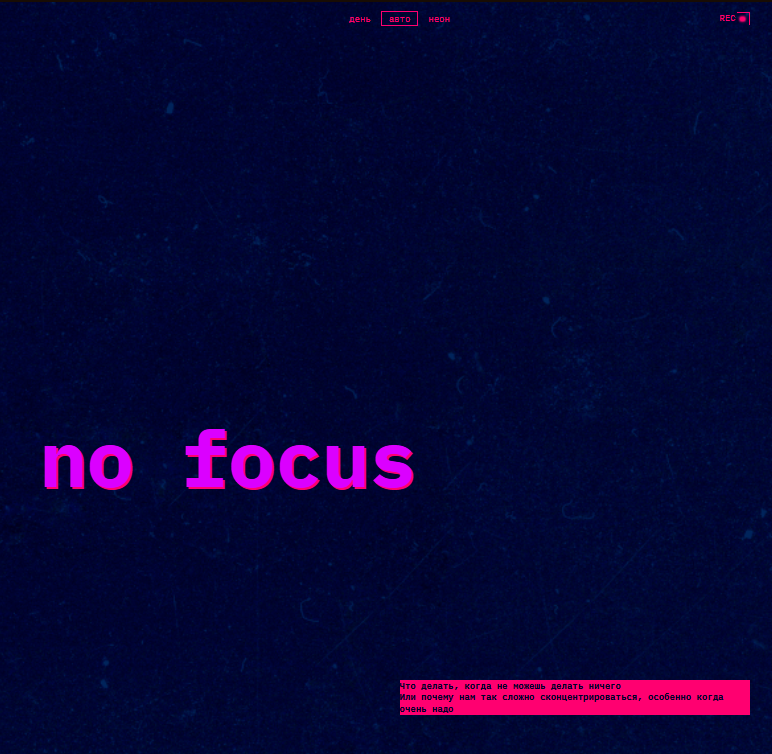
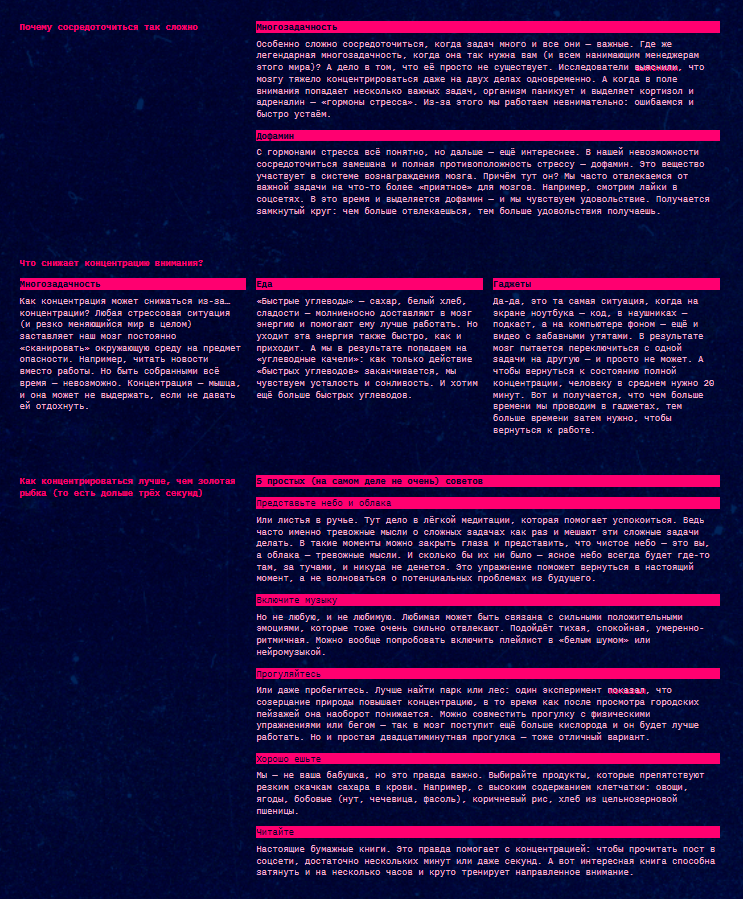

https://nikitosii.github.io/slozhno-sosredotochitsya-ad/

# Сложно сосредоточиться

Учебный проект курса Яндекс Практикум — адаптивная веб-страница о концентрации внимания.

## Технологии

- HTML / CSS
- CSS Custom Properties (переменные для тем)
- CSS Grid Layout
- Mobile-first адаптивная вёрстка (375px → 768px → 1024px)
- Переключение тем: «День», «Авто», «Неон»

## Особенности

- Три цветовые темы — тёмная (по умолчанию), светлая и автоматическая по системным настройкам
- Декоративные угловые рамки через `::before` / `::after`
- Мозаичная фотогалерея на CSS Grid
- Плавный переход размера заголовка через `clamp()`
- Фоновое изображение с эффектом параллакса (`background-attachment: fixed`)

## Скриншоты

### Хедер — тёмная тема

### Контентные секции — тёмная тема

### Галерея изображений

